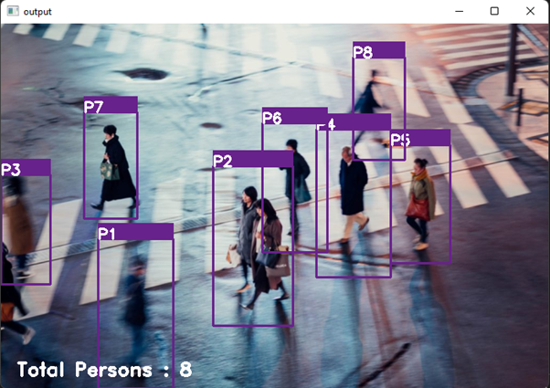
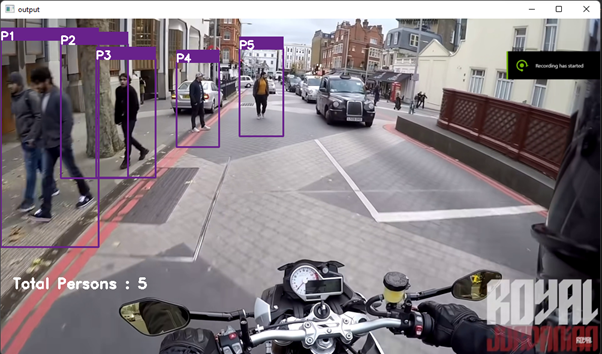

# 🚶 Pedestrian Detection using OpenCV

[](https://www.python.org/)                 
[](https://www.python.org/downloads/release/python-360/)

 A computer vision project that detects pedestrians in real-time from images and video streams using the **Histogram of Oriented Gradients (HOG)** descriptor combined with a **Support Vector Machine (SVM)** classifier — built entirely with OpenCV and Python.

---

## 🧠 How It Works

The project uses OpenCV's built-in **HOG + SVM people detector**, which works by:

1. **Sliding a detection window** across the image at multiple scales
2. **Extracting HOG features** from each window to capture edge and gradient structure
3. **Classifying** each window using a pre-trained SVM to detect human shapes
4. **Applying Non-Maximum Suppression (NMS)** to eliminate overlapping bounding boxes
5. **Labelling** each detected pedestrian with an ID and a running count on screen

---

## ✨ Features

- Detects multiple pedestrians in a single frame
- Works on both **static images** and **live video / pre-recorded footage**
- Labels each detected person individually (P1, P2, P3 ...)
- Displays total person count on the output frame
- Supports webcam feed and video file input

---

## 🛠️ Tech Stack

| Component | Technology |
|---|---|
| Language | Python 3.x |
| Computer Vision | OpenCV (`opencv-contrib-python`) |
| Detection Algorithm | HOG + SVM (built into OpenCV) |
| Bounding Box Filtering | Non-Maximum Suppression via `imutils` |
| Array Operations | NumPy |

---

## ⚙️ Setup & Installation

### 1. Clone the repository
```bash
git clone https://github.com/faaizhamid07/pedestrian-detection.git
cd pedestrian-detection
```

### 2. Install dependencies
```bash
pip install -r requirements.txt
```

### 3. Run detection

**On an image:**
```bash
python image_op.py
```

**On a video file or webcam:**
```bash
python video-cam.py
```

> Update the file path inside `image_op.py` or `video-cam.py` to point to your own image or video.

---

## 📁 Project Structure

```
pedestrian-detection/
│
├── Human_Detection.py   # Core HOG+SVM detection logic
├── image_op.py          # Run detection on a static image
├── video-cam.py         # Run detection on a video file or webcam
├── requirements.txt     # Python dependencies
└── testing/             # Sample images and video for testing
    ├── t1.jpg
    ├── t2.jpg
    ├── t3.jpg
    └── v3.mp4
```

---

## 📦 Requirements

```
opencv-contrib-python
numpy
imutils
```

---

## 📸 Sample Output

### Detection in still image – I


### Detection in moving video – II


---

## 🙋 Author

**Faaiz Hamid**  
M.Tech — Information Technology, USICT, GGSIPU  
[GitHub](https://github.com/faaizhamid07)

## Follow me and give a star⭐ on my repository
## [Donate me on PayPal(It will inspire me to do more projects)](https://www.paypal.me/satiress)

